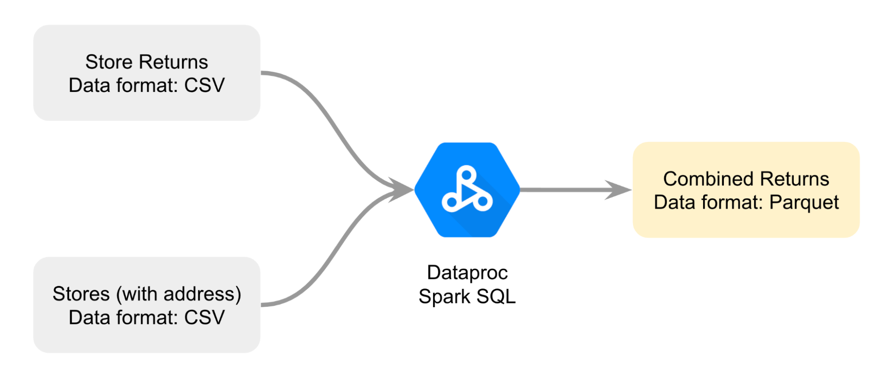

# returns-lakehouse-pipeline
Retail Returns Lakehouse Pipeline — Dataproc, Spark &amp; BigQuery

### Project Overview
This project demonstrates how raw retail returns data stored in cloud storage can be transformed and analyzed using a lakehouse architecture.
The pipeline integrates distributed processing with warehouse analytics to generate return insights across store locations.

### Architecture Components
| Layer           | Tool             | Purpose                     |
| --------------- | ---------------- | --------------------------- |
| Data Lake       | Cloud Storage    | Raw CSV storage             |
| Processing      | Dataproc + Spark | Data transformation         |
| Storage Format  | Parquet          | Optimized analytics storage |
| Warehouse       | BigQuery         | Structured querying         |
| Dev Environment | JupyterLab       | Notebook execution          |

### Key Pipeline Steps
1️.  Data Ingestion
  - Returns CSV loaded from stores
  - Address CSV loaded from store registry

2️.  Data Processing
Executed in Dataproc via Spark:
  - Spark session created
  - CSVs loaded as DataFrames
  - Joined on store_id

3️.  Data Export
  - Output written as Parquet
  - Stored in Cloud Storage

4️.  Warehouse Loading
Parquet loaded into BigQuery standard table using:
`LOAD DATA OVERWRITE ...`

5️.  Analytics Queries
Examples:
  - Return counts
  - Monthly return trends
  - Status distribution

### Business Use Case
This pipeline enables retailers to:
  - Track return volume by store
  - Identify problematic markets
  - Monitor return status trends
  - Improve logistics planning

### Key Technical Concepts Demonstrated
  - Distributed data processing
  - Spark SQL analytics
  - Data lake → warehouse pipelines
  - Parquet optimization
  - Cloud-native ETL workflows

